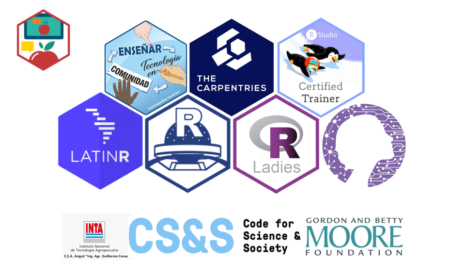

# MetaDocencia 

 
 

.center[### "It is an inclusive and collaborative community that seeks to improve education by empowering teachers from less favored countries"]
  

???
Pao: Hi, my name is Paola!
Ivan: I am Ivan
Elio: and I'm Elio
Pao again: we are part of the MetaDocencia team. We want to share with you our experience teaching how to teach without losing anyone along the way. 
Next slide

A little over a year ago, when the pandemic was a distant notion and teachers in Argentina were preparing to start the school year like any other year, all face-to-face activities, including classes, were suspended. From one day to the next. In that situation, we asked ourselves what we could do to help other people and put into practice what we knew how to do partly thanks to organisations like The Carpentries and RStudio. A few days later MetaDocencia began to take shape.

MetaDocencia is an inclusive and collaborative community that seeks to improve education by empowering teachers in disadvantaged countries. Our initial idea was to share tips and practical tools that could be applied immediately.

But then we realised that it was an opportunity to open up a larger discussion: How do we teach? How can we learn to teach in community? And that's how we came up with the name: "Meta" "Docencia" because we aim to teach how to teach with an eye on our students, at the same time teachers, learning from each other's experience. 
Next slide

---
#### The team

.center[

]

???
We started with just a few people in the team, today 21 people make MetaDocencia possible together with a great advisory team of education and community specialists. 

We come from different places, some from the R world, others from Python, several teachers and interested in education. We live in different parts of Argentina and other countries, we speak Spanish, some Portuguese. We are united by diversity, the desire to teach and learn in community. 

Next slide

---

## What did we do until today?

* We developed and adapted 4 workshops 

    * `r emo::ji("apple")` Introduction to ABC to teach online
    
    * `r emo::ji("green_apple")` How to teach programming

    * `r emo::ji("tv")` Zoom Workshop

    * `r emo::ji("teacher")` {Learnr} Workshop

???
What have we done so far?
We developed and adapted 4 workshops

First, our "Introduction to the ABC's of teaching online" a quick guide to tools to apply in the classroom, sometimes virtual, sometimes in person.

In How to Teach Programming we took the time to talk about how we teach programming and our experience applying the tips from the Teaching Tech Together book. 
The Zoom Workshop.

Workshop and the {learnr} Workshop to learn how to make interactive tutorials also added to the practical toolbox.

Those who participate in the courses not only listen to our advice but also experience it first-hand. For example, at each meeting we discuss the importance of giving and receiving good feedback as a way to improve the classes. So at the end of each workshop we teach by example and ask each participant to answer our anonymous survey with one thing we should keep and one thing we could improve. In the Zoom workshop we invite them to step over to the other side and take the reins of the meeting to experiment with the tool while we think about how we can make the most of it in our classes. In short, we not only invite participants to listen to what we teach, but also to pay attention to how we teach it and discuss how best to do it. 

Next slide

---

#  Countries reached by MetaDocencia 

.center[

]

???
To date, 870 students/teachers have participated in our courses. We taught 55 editions of the Introduction to ABC and 13 editions of our other workshops. In total, we reached more than 1200 Spanish-speaking educators in 30 different countries. 
We had participants from many areas of education, though mostly from the exact sciences. It was surprising to meet many people who teach outside of educational institutions, teaching music or yoga!

Next slide
---

## Why MetaDocencia?

* English can be a barrier
* A translation sometimes is not enough
* Build a local community

.right[

 

]

???

With so many open education resources and communities around the world, you may be wondering why MetaDocencia is needed.

First of all, most online education resources and communities speak English, and in Argentina and many Latin American countries, English is a major barrier to accessing knowledge. In Argentina, less than half of the population has a minimal command of English and of those who do, the vast majority know very little. Therefore, it is more than clear that even the best resource is inaccessible to a large part of the educator population if it is in English. 

But even translations, whether done with a computer or a human being, are not enough. Originally English resources are based on very strong assumptions about culture, access to certain resources and familiarity with technologies such as zoom, slack or google docs. Considering the digital divide, this is not always applicable to the diverse contexts that exist in Latin America. 

Finally, the idea of "communities of practice" is quite new in our region. There is no habit of sharing the materials that teachers generate for their classes; sometimes the opposite is true. Nor do institutions encourage these practices, even internally. That's why we borrowed what we learned from the R community in general and from R-Ladies in particular to shape MetaDocencia.

Ultimately we met with teachers in Latin America, where they are in their context and realities. 

Next slide
---

 
 
 
 
 
.pull-right[

]

???

So far we have told you what MetaDocencia is. Throughout these months, we have learned many things: from the experience, from the feedback of our participants, from other communities. Other things, ideas and values, have been with us since day one. 

Next slide
---
class: chapter-slide

# Accessibility helps everyone.

???

The first idea we want to share with you is: "Accessibility helps everyone".

Next slide
---

.center[

]

???

From the beginning we set out to generate materials that were accessible, starting with what we had at hand at the time: including speaker's notes in our presentations. We wanted people with visual impairments to be able to use the materials in the same way. But we also thought about those who didn't have the time or a good internet connection to do the course synchronously, who came across the presentation and needed a guide to walk them through it. 

We then found that those speaker notes, written with great detail and dedication, helped us to familiarise the new people on the team with the course and the materials and prepare them to teach it. 

Next slide
---

.center[

]

???

But desire and good will are not enough. We needed to continue learning about accessibility, for example by broadening the concept and thinking about other disabilities in addition to visual impairment. This is how the MetaDocencia Accessibility team was born, thanks to the support of the Code for Science and Society, which motivated us and gave us the necessary support so that some members of the team could dedicate time to this topic. 

In Latin America more than 15% of the population experiences some kind of disability, which generates situations of inequality in access to the labour market as well as to education and health, and they are more likely to have a very low socio-economic level. And this situation is especially accentuated by the pandemic. 

All these reasons made us think that the tools we offered should aim to include as many people as possible. 

Accessibility is universal. It means planning, designing, building, and maintaining our courses in a way that takes into account the needs and requirements of all people, whatever their age, status or ability. In the context of MetaDocencia, it was necessary to design the material with different types of learners, their needs and/or difficulties in mind in order to gradually lower the barriers of access to our courses and materials.

Next slide
---

.center[

]

???
Accessibility must be considered from the moment the activity is planned. A chain of accessibility guarantees continuity in access to spaces that allows connecting places and services, without barriers. In our case, connecting the steps to join the community or participate in a course. It involves adapting the environment where we carry out our activities and how we do it, whether in person or virtually. 

At MetaDocencia we strive to ensure accessibility from the very beginning when a person registers and answers questions that guide us to get to know them better and provide them with the best possible experience. 

One of the first things we had to fix was to add alternative text to all the images in our presentations. We also noticed that the background colour we had chosen for some slides did not have enough contrast with the colour of the letters. We now check that all our materials follow the size and contrast recommendations of the Web Content Accessibility Guidelines.

This also applies to our social media posts and our website, where we publish images with good contrast and alternative text.

Next slide
---

## What and how did we ask about accesibility?

.center[

]

???
In our first registration form, back in March 2020, there were already questions about different aspects of accessibility. We asked about knowledge of different tools such as google docs, zoom, slack, about the quality of internet access and availability of materials such as microphone, computer that works well, familiarity with the use of the keyboard and then about disabilities (visual, hearing, learning, etc...). 

All these questions (which were many) we put together based on intuition and as we looked at the answers we realised that they needed to be changed. Some questions gave useful and actionable answers. If we knew that someone had never used zoom, we knew we needed to put more emphasis on showing how we were going to work on zoom at the beginning of the course. But others were more difficult to interpret - what did we do if someone said they had a "visual impairment", did we have to rely on audio alone or was using large, high contrast print enough? 

Next slide
---

## What and how do we ask about accesibility now?

.center[

]

???
One of the first tasks of the accessibility team was to redesign these questions. 

We took as a reference the questions designed by the Washington Group on Disability Statistics to obtain concrete, unified and tested information about the people, teachers in Latin America who are interested in participating in our courses. 

The disability questions are now fewer, but more informative. 

Do you have any of the following difficulties in participating in workshops remotely? 
Difficulty seeing, difficulty hearing, difficulty interacting with devices or staying more than 50 minutes in front of a screen.

We are aware that these questions may be sensitive information so we also give you the possibility not to answer. And we always keep in mind that people will answer according to their perception of themselves. 

Next slide
---

## How can we facilitate your participation?

.center[

]

???

But we also ask them how we can facilitate their participation and offer various solutions related to the type of difficulty, which allows us to have clear and actionable information on how to adapt our class if necessary.

We also set up a system whereby if someone checks any of the accessibility options, they are immediately emailed to the accessibility team to review the case. The team reviews the responses and if necessary contacts the person to decide together if any changes need to be made to our materials or our course so that the person can participate. 

Next slide
---

##  How can we facilitate your participation?

.center[

]

???

During 2021, of the 540 people who completed our registration form, 87 responded to these questions in the affirmative. Many of these people asked us to pause frequently away from the screen, speak slowly and clearly or use large print materials. We also communicated with 11 of those people to better understand what they needed and to ensure that we and the materials were prepared. 

Next slide
---

## Large font

.center[]

???

The good news is that we have taken all these requests into account from the moment we designed our courses and we have been implementing improvements in all the workshops and materials. We define basic criteria that take into account the needs of a large part of the people who come to MetaDocencia.

For our presentations:
Large print, no one ever complained that the font was too big.

Next slide
---

## High contrast

.center[]

???

Good contrast between letters and background, even if it means changing our favourite colours.
When we checked the contrast of some of our presentations we found that they did not meet the minimum standards. 

Next slide
---

## Avoid animations and fancy fonts, it doesn't matter if it looks cute if it's not accessible

???
Avoid animations and fancy fonts, it doesn't matter if it looks pretty if it's not accessible. 

Next slide
---

## Alternative text in figures and images

.center[

]

???

Alternative text in the figures and images that we include in our presentations and social networks, so that no one misses any detail.

Next slide
---

## Frequent breaks
.center[

]

???
For our courses:
Frequent breaks, because neither teachers nor students can concentrate forever in front of the screen.

Next slide
---

## Everyone participates in their own way

.center[

]

???

Everyone participates in the way they prefer, some people will want to use the microphone, others will want to write in the chat, we value everyone's input equally. 

Next slide
---

## What's still missing
 
 
    

.center[

]

???

For us, it is very important to be prepared to give the teachers who participate in our courses the best experience. So far we were able to meet the needs of all the people who registered. That on the one hand means that our efforts are worthwhile, but on the other hand, it also means that we are not reaching people with other needs, perhaps because in the teaching world, people with disabilities do not find an accessible space. 

Next slide
---
## Iterate to improve

.center[

]

???
We know that we are still missing some things. For example, although we tested and are ready to use subtitles in our classes, they are not manual transcriptions but are generated automatically with a free service, which in a zoom room only works well to subtitle the person who is giving the class but not for the rest of the participants. We definitely need to prepare ourselves more to speak slowly and modulate what we say so that both automatic subtitles and people with hearing difficulties can understand us well.

Also on our list is to improve the subtitles of the videos we upload to YouTube, for now they are created automatically and leave a lot to be desired. Or migrating our Slack community to another platform that is more accessible for people who use screen readers.

Next slide
---

class: chapter-slide

# Don't assume, ask

???

Another idea that has been with us from the beginning is: 
"Don't assume, ask". Don't assume that our participants have access to a good internet connection or that they know how to use a certain tool.

Next slide
---
## Surveys before

.center[

]

???

From day one, the experience of those interested in participating begins with a form that allows us to get to know you: What is your experience as a teacher? How big are your classes? Do you have experience using Zoom?

And perhaps a year and a half into the pandemic this question may seem redundant but there are still some innocent souls who have not been corrupted by Zoom.  

Of course, if we are going to ask questions, we have to read the answers. Before each course, teachers and assistants meet to review these answers and prepare to provide the best learning experience for everyone. If someone responded that they don't have a lot of experience using google docs, surely whoever is there as a helper is going to be more attentive to answer their queries. If anyone missed any part of the course because of their internet connection, we will share the link to the recorded version with you when we get back so you can review it later if you want. 

Next slide
---

## Feedback after each workshop

.center[

]

???

And like all good stories, our courses end with an echo of how they began: with another survey. But this time it is a feedback survey that allows us to evaluate good and bad things about the course. After the class, teachers and assistants take 15 minutes to review the comments. 

This feedback was key to the evolution of our courses. We made sure to keep what most of them found positive and change what they found negative. From the feedback we also noticed certain flaws in our communication that gave false expectations to some attendees.

We also noticed how important it is not to take all feedback too seriously. We often get comments that a course is too long, but we get the same amount of comments saying it's too short, so the length probably couldn't be better. 

Next slide
---

class: chapter-slide

# We learn more and better when we feel welcomed

???

We learn more and better when we feel welcome.

Next slide
---

## Building a friendly space

.center[

]

???

For this reason we are guided by a code of conduct and we ask everyone who participates in MetaDocencia to respect it. It is an invitation to create a friendly space where everyone feels comfortable to participate, ask questions, give feedback to their colleagues and, ultimately, learn. 

In Argentina and Latin America it is not common to hear about a code of conduct and although educational institutions have their regulations, this idea, for us, came from the hand of communities with R-Ladies. That's why we take a few seconds at the beginning of each workshop to explain what it is about, invite everyone to help us generate a friendly environment and give them information on what to do in case that doesn't happen for whatever reason. 

Next slide
---

## Code of Conduct in community

.center[

]

???

Our first code of conduct was an adaptation of Contributor Covenant's Code of Conduct for Open Source Communities. And while it was one of the first things we added to our website long before we ran our first course, it was far from perfect. 

In the infancy of MetaDocencia, when the team could be counted on the fingers of one hand, the coordinating team was in turn in charge of receiving any comments or reports if the Code of Conduct was not respected. But the reality is that we had no protocol to follow, just some intuition and goodwill. 

But what answers could we give? How were we going to handle such situations? What if we received a report and someone from the team was involved or there was a conflict of interest? In other words, who watches the watchers?

We have recently started to answer these questions and reformulate our code of conduct based on what is happening in other communities and in particular in useR!2021. We are defining a team that will be responsible for this process, consisting of members of the coordination team, collaborators and members of the advisory team, in order to provide answers that guarantee the participation of all people in a safe and friendly space. 

Next slide
---

class: chapter-slide

# Open materials for everyone

???
The last principle we wanted to share with you is this: open materials for all people. 

Next slide
---
## Produce, share, reuse

.center[

]

???

Everything we do is openly licensed and at the same time, we draw on other open materials. Another of our core ideas is to ensure access to quality materials by sharing what we do openly and encouraging others to do so too.

We believe this is even more important when the resources we have are scarce: why not take advantage of peer-generated and peer-tested materials, giving credit along the way? At MetaDocencia we seek to generate this, producing materials, sharing others and providing a space in our slack community for people to share their experience of using a material or tool. 

The fact that everything we do is free is no coincidence. It is part of our commitment to reduce and eliminate the barriers that exist between people and quality materials and tools in Latin America. 

Next slide
---

## MetaDocencia in a box

.center[

]

???
Somewhere along the way we realised that our added value is not just isolated resources but a way of working. Just stamping a creative commons logo on a presentation or a post on the web is not enough to encourage the reuse of our materials, nor is it enough to ensure that this reuse is in the spirit of MetaDocencia. 

That's why we started working on "MetaDocencia in a box", a comprehensive guide that documents our materials and how we work so that anyone can replicate what we do and feed off everything we learned along the way and without making our mistakes. 

Next slide
---
## What's next?

 
 
.left[

]

???

In this story, we have somehow reached the present. Where do we go from here?

Last year MetaDocencia ran 100% on voluntary work but we know that this is not sustainable. For 2021 we got funding from the Code for Science and Society and the Gordon and Betty Moore Foundation to cover our activities, but we continue to work to find new sources of funding that will allow us to continue doing what we do in the future.

We will continue to develop MetaDocencia en caja, a guide so that anyone can replicate or learn from our experience, for now in Spanish but very soon in Portuguese. 

Another very important goal for this year is to measure and evaluate what we are doing, we hope soon to be able to share results and most likely what we learned in the process. 

And of course, we will continue learning in community. In addition to continuing our workshops, which will continue to be free of charge, we are starting to design short meetings where we can discuss and learn about a particular tool or resource. It will also be a space for the teaching community to meet and perhaps motivate other people to share their experience as MetaDocente. 

Next slide
---

# Fertile soil

.center[

]

???

None of what we did would have been possible without the pre-existing communities. Communities like R-Ladies, LatinR, R User Groups, The Carpentries and RStudio. From them we took not only knowledge and materials, but also the friendships that brought us together to form MetaDocencia in the beginning. 

Nor would it have been possible to continue sustaining our activities and free courses without the support of INTA and funding from the Code for Science and Society and the Gordon and Betty Moore Foundation.

Next slide
---
class: end-slide

# Thank you!
## Teaching to teach without losing anyone along the way

 
 
 
 
 
 
 
 
 
 
 
 
 
 

`r icons::icon_style(icons::fontawesome$solid$globe, fill = "#485a6c")` metadocencia.org 
 
 
.right[Illustrations by [Manfred Steger](https://pixabay.com/es/users/manfredsteger-1848497/)]

???

Thank you so much for joining us to teach without losing anyone along the way. 

