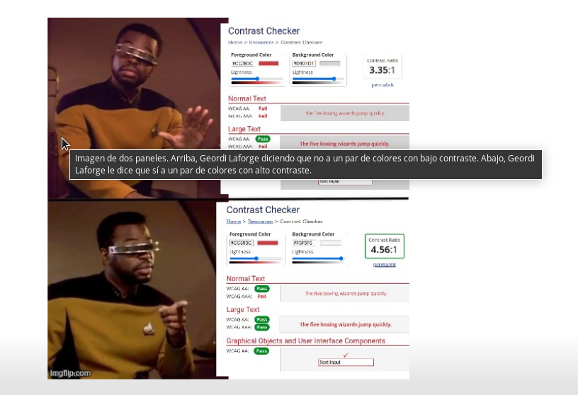
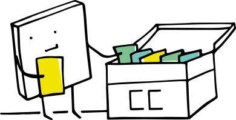

## MetaDocencia es una comunidad inclusiva y colaborativa que busca que mejorar la educación potenciando docentes de países menos favorecidos  

???
Pao: Hola! Mi nombre es Paola
Ivan: Yo soy Ivan
Elio: y yo soy Elio
Pao de nuevo: somos parte del equipo de MetaDocencia. Queremos compartir con ustedes nuestra experiencia enseñando a enseñar sin perder a nadie en el camino. 

Hace un poco más de un año, cuando la pandemia era una noción distante y les docentes en Argentina se preparaban para empezar el año de clases como cualquier otro año, tolas las actividades presenciales, incluyendo las clases, se suspendieron. De un día para el otro. En esa situación, nos preguntamos qué podíamos hacer para ayudar a otras personas y poner en práctica lo que sabíamos hacer en parte gracias a organizaciones como The Carpentries y RStudio. Unos pocos días después MetaDocencia comenzó a tomar forma.
MetaDocencia es una comunidad inclusiva y colaborativa que busca mejorar la educación potenciando docentes de países menos favorecidos. Nuestra idea inicial era compartir consejos y herramientas prácticas que pudieran aplicarse de manera inmediata.
Pero luego nos dimos cuenta que era una oportunidad para abrir una discusión más grande: ¿Cómo enseñamos? ¿Cómo podemos aprender a enseñar en comunidad? Y así surgió el nombre: “Meta” “Docencia” porque nos proponemos enseñar a enseñar con la mirada puesta en nuestros estudiantes, al mismo tiempo docentes, aprendiendo de la experiencia de cada une. 

---
class: inverse, center, middle

???
Empezamos siendo unas pocas personas en el equipo, hoy 21 personas hacen posible MetaDocencia junto a un gran equipo asesor formado por especialistas en educación y comunidades. Venimos de distintos lugares, algunes del mundo de R, otres de Python, varios docentes e interesades en educación. Vivimos en diferentes partes de Argentina y de otros países, hablamos Español, algunes Portugués. Nos une la diversidad, las ganas de enseñar y de aprender en comunidad. 

---

## ¿Qué hicimos hasta hoy?

* Desarrollamos y adaptamos 4 talleres 

--

    * Introducción al ABC para enseñar online
--
  
    * Cómo enseñar a programar
--
    
    * Taller de Zoom
--
    
    * Taller de {learnr}

???
¿Qué hicimos hasta hoy?
Desarrollamos y adaptamos 4 talleres 
Primero, nuestro “Introducción al ABC para enseñar online” una guía rápida de herramientas para aplicar en el aula, a veces virtual, a veces en persona.
En Cómo enseñar a programar nos sacamos las ganas de charlar sobre como enseñamos programación y nuestra experiencia aplicando los consejos de Teaching Tech Together. 
El Taller de Zoom y el Taller de {learnr} para aprender a hacer tutoriales interactivos también se sumaron a la caja de herramientas prácticas.
Quienes participan de los cursos no sólo escuchan nuestros consejos sino que los viven en carne propia. Por ejemplo, en cada encuentro discutimos sobre la importancia de dar y recibir buen feedback como una manera de mejorar las clases. Por eso al final de cada taller enseñamos con el ejemplo y les pedimos a cada participante que responda nuestra encuesta anónima con algo que tendríamos que mantener y algo que podríamos mejorar. En el taller de Zoom les invitamos a pasarse al otro lado y tomar las riendas de la reunión para experimentar con la herramienta mientras pensamos cómo podemos sacarle el jugo en nuestras clases. En definitiva, no sólo invitamos a les participantes a escuchar lo que enseñamos, sino también a prestar atención a cómo lo enseñamos y discutir sobre la mejor manera de hacerlo. 

---

grafico va acá

???
Hasta hoy, 870 estudiantes / docentes participaron en nuestros cursos. Enseñamos 55 ediciones de la Introducción al ABC y 13 ediciones de nuestros otros talleres. En total, llegamos a más de 1200 educadores de habla hispana en 30 países distintos. 
Tuvimos participantes de muchas áreas de educación, aunque en su mayoría vienen de las ciencias exactas. Fue sorprendente encontrarnos con muchas personas que enseñan fuera de instituciones educativas, dando clases de música o yoga!

---

## ¿Por qué MetaDocencia?

???

Habiendo tantos recursos abiertos en educación, y comunidades alrededor del mundo, tal vez se estén preguntado ¿para qué se necesita MetaDocencia?

En primer lugar la mayoría de los recursos y comunidades sobre educación online hablan inglés y en Argentina y muchos países de Latinoamérica, el inglés es una gran barrera para el acceso al conocimiento. En Argentina, menos de la mitad de la población tiene un mínimo manejo del inglés y de los que saben, la enorme mayoría saben muy poco. Por lo tanto, está más que claro que aún el mejor recurso, es inaccesible para una gran parte de la población de educadores si está en inglés. 

Pero aún las traducciones, sean hechas con una computadora o un ser humano no son suficientes. Los recursos originalmente anglos, se basan en suposiciones muy fuertes sobre la cultura, el acceso a determinados recursos y la familiaridad con tecnologías como zoom, slack o google docs. Esto no siempre es aplicable a los diversos contextos que existen en América Latina, por ejemplo si tenemos en cuenta la brecha digital. 

Finalmente, la idea de “comunidades de práctica” es bastante nueva en nuestra región. No existe la costumbre de compartir los materiales que docentes generan para sus clases, a veces pasa todo lo contrario. Las instituciones tampoco incentivan estas prácticas ni si quiera internamente. Por eso tomamos prestado lo que aprendimos gracias a la comunidad de R en general y de R-Ladies en particular para darle forma a MetaDocencia.

---

???

Hasta acá les contamos qué es MetaDocencia. A lo largo de estos meses, aprendimos muchas cosas: de la experiencia, del feedback de nuestros participantes, de otras comunidades. Otras cosas, ideas y valores , nos acompañan desde el primer día. 

---
class: chapter-slide

# “La accesibilidad ayuda a todas las personas.”

???

La primera idea que queremos compartir es: “La accesibilidad ayuda a todas las personas.”

---

.center[
]

???

Desde el inicio nos propusimos generar materiales que fueran accesibles, empezando con lo que teníamos a mano en ese momento: incluir notas de orador en nuestras presentaciones. Queríamos que personas con dificultad visual pudieran aprovechar los materiales de la misma manera. Pero también pensamos en quienes no contaban con el tiempo o una buena conexión a internet para hacer el curso de manera sincrónica, quienes se encontraban con la presentación y necesitaban una guía para recorrerla. 

Luego descubrimos que esas notas del orador, escritas con mucho detalle y dedicación, nos servían para que las nuevas personas del equipo se familiarizaran con el curso y los materiales y se pudieran preparar para enseñarlo. 

---

???

Pero las ganas y buena voluntad no son suficientes. Necesitábamos seguir aprendiendo sobre accesibilidad, por ejemplo ampliando el concepto y pensando en otras discapacidades además de la visual. Así nació el equipo de Accesibilidad de MetaDocencia, gracias al apoyo de la  Code for Science and Society que nos motivó y dio el apoyo necesario para que algunas personas del equipo pudieran dedicar tiempo a este tema. 

En Latinoamérica más del 15% de la población experimenta algún tipo de discapacidad, lo que genera situaciones de desigualdad en el acceso al mercado laboral como también a la educación y salud y es más probable que tengan un nivel socioeconómico muy bajo. Y toda esta situación se ve especialmente acentuada por la pandemia. 

Todas estas razones nos hicieron pensar en que las herramientas que ofrecíamos debían aspirar a incluir a la mayor cantidad de personas posibles. 

La accesibilidad es algo universal. Implica planear, proyectar, construir, y conservar nuestros cursos de modo que tenga en cuenta las necesidades y los requerimientos de todas las personas, sea cual sea su edad, condición o capacidad. En el contexto de MetaDocencia, era necesario diseñar el material pensando en diferentes tipos de estudiantes, sus necesidades y / o dificultades para paulatinamente disminuir las barreras de acceso a nuestros cursos y materiales.

---

???
La accesibilidad debe ser pensada desde el momento de la planificación de la actividad. Una cadena de accesibilidad garantiza la continuidad en el acceso a los espacios que permite conectar lugares y servicios, sin barreras. En nuestro caso, conectar los pasos para sumarse a la comunidad o participar en un curso. Implica la adecuación del entorno donde desarrollamos nuestras actividades y cómo lo hacemos, ya sea en persona o virtual. 

En MetaDocencia nos esforzamos para garantizar la accesibilidad desde el inicio cuando una persona se registra y responde preguntas que nos orientan para conocerla mejor y brindarle la mejor experiencia posible. 

Una de las primeras cosas que tuvimos que arreglar fue la de agregar texto alternativo a todas las imágenes de nuestras presentaciones. También vimos que el color de fondo que habíamos elegido para algunas diapositivas no tenía suficiente contraste con el color de las letras. Ahora chequeamos que todos nuestros nuestros materiales sigan las recomendaciones de tamaño y contraste de las Directrices de Accesibilidad para el Contenido Web.

Esto también aplica a nuestras publicaciones en redes sociales y nuestra web, donde publicamos imágenes con buen contraste y texto alternativo.

---

## ¿Qué y cómo preguntamos sobre accesibilidad?

.center[

]

???
En nuestro primer formulario de registro, allá por marzo de 2020,  ya había preguntas sobre distintos aspectos de accesibilidad. Preguntábamos sobre conocimiento de distintas herramientas como google docs, zoom, slack, sobre la calidad del acceso a internet y disponibilidad de materiales como micrófono, computadora que ante bien, familiaridad con el uso del teclado y luego sobre discapacidades que (visuales, auditivas, aprendizaje, etc…). 

Todas estas preguntas (que eran muchas) las armamos en base a la intuición y a medida que veíamos las respuestas nos dimos cuenta que necesitaban un cambio. Algunas preguntas daban respuestas útiles y accionables. Sí sabíamos que alguien nunca había usado zoom, sabíamos que teníamos que hacer más hincapié al mostrar cómo íbamos trabajar en zoom al comienzo del curso. Pero otras eran más difíciles de interpretar. ¿Qué hacíamos si alguien decía que tenía una “discapacidad visual”? ¿Teníamos que basarnos sólo en el audio o con usar letra grande y con alto contraste era suficiente? 

---

## ¿Qué y cómo preguntamos sobre accesibilidad?

.center[

]

???
Una de las primeras tareas del equipo de accesibilidad fue la de rediseñar estas preguntas. 

Tomamos como referencia las preguntas diseñadas por el Grupo de Washington sobre Estadísticas de la Discapacidad para obtener información concreta, unificada y probada sobre las personas, docentes de Latino América que les interesa participar en nuestros cursos. 

Las preguntas sobre discapacidad ahora son menos, pero más informativas. 

¿Tienes alguna de las siguientes dificultades para participar de talleres en forma remota? 
Dificultad para ver, para oír, dificultad para interactuar con dispositivos o permanecer más de 50 minutos delante de una pantalla.

Somos conscientes que estas preguntas pueden ser información sensible por lo que también les damos la posibilidad de no no responder. Y siempre tenemos en cuenta que las personas responderan de acuerdo a la percepción que tienen sobre si mismas. 

---

## ¿Qué y cómo preguntamos sobre accesibilidad?

.center[

]

???

Pero además les preguntamos cómo podemos facilitar su participación y ofrecemos diversas soluciones relacionadas con el tipo de dificultad, lo cual nos permite tener una información clara y accionable sobre cómo adaptar nuestra clase si fuera necesario.

Además armamos un sistema mediante el cual si alguien marca alguna de las opciones de accesibilidad, inmediatamente se les envía un mail al equipo de accesibilidad para que revisen el caso. El equipo revisa las respuestas y si es necesario se pone en contacto con la persona para decidir en conjunto si es necesario hacer algún cambio a nuestros materiales o a nuestro curso para que esa persona pueda participar. 

---

## ¿Qué y cómo preguntamos sobre accesibilidad?

.center[

]

???

Durante 2021, de las 540 personas que completaron nuestro formulario de registro, 87 respondieron a estas preguntas de manera afirmativa. Muchas de esas personas nos pidieron hacer pausas frecuentes lejos de la pantalla, hablar lento y claro o usar materiales con letra grande.

---

<!-- # Estándares -->

## Letra grande

.center[]

???

La buena noticia es que tenemos en cuenta todos estos pedidos desde el momento que pensamos nuestros cursos y hemos ido implementando mejoras en todos los talleres y materiales. Definimos criterios de base que tienen en cuenta las necesidades de una gran parte de las personas que se acercan a MetaDocencia.

Para nuestras presentaciones:
Letra grande, nunca nadie se quejó de que la letra era demasiado grande.

---

## Buen contraste

.center[]

???

Buen contraste entre las letras y el fondo, aun si eso implica cambiar nuestros colores favoritos.
Al chequear el contraste de algunas de nuestras presentaciones nos dimos cuenta que no cumplían con los estándares mínimos. 

---

## Evitar animaciones y fuentes de adorno, no importa que se vea lindo si no es accesible. 

???
Evitar animaciones y fuentes de adorno, no importa que se vea lindo si no es accesible. 

---

## Texto alternativo en figuras e imágenes 

.center[

]

???

Texto alternativo en figuras e imágenes  que incluimos, para que nadie se pierda ningún detalle.

Evitar animaciones y fuentes de adorno, no importa que se vea lindo si no es accesible. 
Texto alternativo en las figuras e imágenes que incluimos, para que nadie se pierda ningún detalle.

Para nuestros cursos:
Pausas frecuentes, porque ni docentes ni estudiantes puede estar concentrados eternamente frente a la pantalla
Cada quien participa de la manera que prefiera, algunas personas querrán usar el micrófono, otras escribir en el chat, valoramos los aportes de todas las personas de igual manera. 

Para nuestras redes sociales:
Acompañamos cada imagen con texto alternativo 
Usamos lenguaje que incluya a todas las personas. 

Para nosotros, estar preparados para brindarle a les docentes que participan en nuestros cursos la mejor experiencia es muy importante. Hasta ahora pudimos cubrir las necesidades de todas las personas que se registraron. Eso por un lado significa que nuestros esfuerzos valen la pena, pero por el otro, también significa que no estamos llegando a personas con otras necesidades, tal vez porque en el mundo de la enseñanza, las personas con discapacidades no encuentran un espacio accesible. 

---

(algunan imagen de zoom con subtítulos)

???
Sabemos que nos faltan algunas cosas todavía. Por ejemplo, si bien probamos y y estamos listes para usar subtítulos en nuestras clases, éstos no son transcripciones manuales sino que son generadas automáticamente con un servicio gratuito, que en una sala de zoom sólo funciona bien para subtitular a la persona que está dando a clase pero no para el resto de los participantes. Definitivamente necesitamos prepararnos más para hablar pausado y modular lo que decimos para tanto los subtítulos automáticos como personas con dificultades auditivas nos puedan entender bien.

En nuestra lista también está mejorar los subtítulos de los videos que subimos a YouTube, por ahora son creados automáticamente y dejan mucho que desear. O migrar nuestra comunidad en Slack a otra plataforma más accesible para personas que usan lectores de pantalla.

---

class: chapter-slide

# No asumir, preguntar

???

Otra de las ideas que nos acompaña desde el principio es: 
“No asumir, preguntar”. No asumir que nuestros participantes tienen acceso a una buena conexión a internet o que saben usar determinada herramienta.”

---

???

Y eso hicimos hasta ahora, incluimos en nuestro formulario de registro preguntas para conocer a nuestros futuros y futuras estudiantes. ¿Qué experiencia tienen usando zoom? 
Y tal vez a un año y medio de haber comenzado la pandemia esta pregunta puede parecer redundante pero igual que al principio decidimos no asumir y por el contrario nos proponemos conocer a nuestros estudiantes en su contexto y teniendo en cuenta su realidad. 

Por supuesto eso no termina ahí, antes de cada curso, docentes y ayudantes se reúnen para revisar estas respuestas y prepararse para poder brindar la mejor experiencia de aprendizaje a todas las personas. Si alguien respondió que no tiene mucha experiencia usando documentos de google, seguramente quién esté como ayudante estará pendiente para responder a sus consultas. Si alguien se perdió alguna parte del curso por su conexión a internet, a la vuelta le compartiremos el link a la versión grabada para que pueda revisar después si quiere. 

---

???

Gracias al feedback de quienes participaron en nuestros cursos, nos dimos cuenta que esto era clave a la hora de conocer a nuestros estudiantes. Y esto es importante por varias razones. Por supuesto nos preparamos y preparamos nuestras clases de acuerdo a las personas a las que les enseñaremos, previendo posibles dificultades y barreras. Pero además les demostramos que nos interesa conocerles, valorando su experiencia y lo que puedan aportar para aprender entre todes. 

---

class: chapter-slide

# Aprendemos más y mejor cuando nos sentimos bienvenidos.

???

Aprendemos más y mejor cuando nos sentimos bienvenidos.

---

???

Por esta razón nos guiamos por un código de conducta y les pedimos a todas las personas que participan en MetaDocencia que lo respeten. Es una invitación a generar un espacio amigable donde todas las personas se sientan cómodas para participar, hacer preguntas, dar feedback a sus colegas y en definitiva, aprender. 

En Argentina y Latinoamérica no es común escuchar hablar de un código de conducta y si bien las instituciones educativas tienen sus reglamentos esta idea, para nosotros, vino de la mano de comunidades con R-Ladies. Por eso nos tomamos unos segundos al comienzo de cada taller para explicar de qué se trata, invitar a todas las personas a ayudarnos a generar un ambiente amigable y darles información sobre qué hacer en caso de que eso no ocurra por la razón que sea. 

---

???
Nuestro primer código de conducta fue una adaptación del Código de Conducta para comunidades Open Source de Contributor Covenant. Y si bien fue una de las primeras cosas que sumamos a nuestra web mucho antes de dar nuestro primer curso, estaba muy lejos de ser perfecto. 

En la infancia de MetaDocencia, cuando el equipo se contaba con los dedos de una mano, el equipo coordinador era a su vez encargado de recibir cualquier comentario o reporte si el Código de Conducta no era respetado. Pero la realidad es que no teníamos un protocolo a seguir, solo algo de intuición y buena voluntad. 

Pero qué respuestas podíamos dar? Cómo íbamos a manejar este tipo de situaciones? Qué pasaba recibíamos algún reporte y alguien del equipo estaba involucrado o había conflictos de intereses? 

Hace poco empezamos a responder a esas preguntas y reformular nuestro código de conducta en base a lo que en otras comunidades y en particular en useR!2021. Estamos definiendo un equipo que se haga responsable de este proceso formado por miembros del equipo de coordinación, colaboradores y miembros del equipo asesor para poder dar respuestas que garanticen la participación de todas las personas en un espacio seguro y amigable. 

---

class: chapter-slide

# Materiales abiertos para todas las personas

???
El último principio que queríamos compartir con ustedes es este: materiales abiertos para todas las personas. 

---
# Título con algo

.center[

]

???

Todo lo que hacemos tiene licencia abierta y al mismo tiempo, nos nutrimos de otros materiales abiertos. Otra de nuestras ideas centrales es garantizar el acceso a materiales de calidad compartiendo lo que hacemos de manera abierta y fomentando a otras personas para que también lo hagan.

Creemos que esto es aún más importante cuando los recursos con los que contamos son escasos. ¿Por qué no aprovechar los materiales generados y probados por un colega, dando crédito en el camino? En MetaDocencia buscamos generar esto, produciendo materiales, compartiendo otros y brindando un espacio en nuestra comunidad de slack para que las personas puedan compartir su experiencia al usar un material o una herramienta. 

Que todo lo que hacemos, sea gratuito para las personas que participan no es casualidad. Es parte de nuestro compromiso para disminuir y eliminar las barreras que existen entre las personas y los materiales y herramientas de calidad en América Latina. 

---

# Título con algo

.center[

]

???
En alguna curva del camino nos dimos cuenta que nuestro valor agregado no son sólo recursos aislados sino una forma de trabajar. Con solo ponerle una licencia abierta a una presentación o un post en la web no alcanza para incentivar el reuso de nuestros materiales ni que ese reuso sea con el espíritu de MetaDocencia. 

Por eso empezamos a trabajar en “MetaDocencia en una caja”, una guía integral que documenta nuestros materiales y nuestro funcionamiento para que cualquiera pueda replicar lo que hacemos y alimentándose de todo lo que aprendimos en el camino y sin cometer nuestros errores. 

---

???

En esta historia, llegamos de alguna manera al presente. ¿Qué sigue a partir de ahora?

El año pasado MetaDocencia funcionó 100% con trabajo voluntario pero sabemos que eso no es sostenible. Para 2021 obtuvimos financiamiento de la Code for Science and Society y la Gordon and Betty Moore Foundation para cubrir nuestras actividades, pero continuamos trabajando para encontrar nuevas fuentes de financiamiento que nos permitan continuar haciendo lo que hacemos en el futuro.

Seguiremos desarrollando MetaDocencia en caja, una guía para que cualquier persona pueda replicar o aprender de nuestra experiencia, por ahora en español pero muy pronto en portugues. 

Otro objetivo, muy importante para este año es medir y evaluar lo que estamos haciendo, esperamos pronto poder compartir resultados y muy seguramente lo que aprendimos en el proceso. 

Y por supuesto, seguiremos aprendiendo en comunidad. Además de seguir dictando nuestros talleres que seguirán siendo gratuitos, comenzamos a diseñar encuentros cortos donde podamos discutir y aprender sobre alguna herramienta o recurso en particular. Que sea además un espacio de encuentro de la comunidad de docentes y que tal vez motive a otras personas a compartir su experiencia como MetaDocente. 

